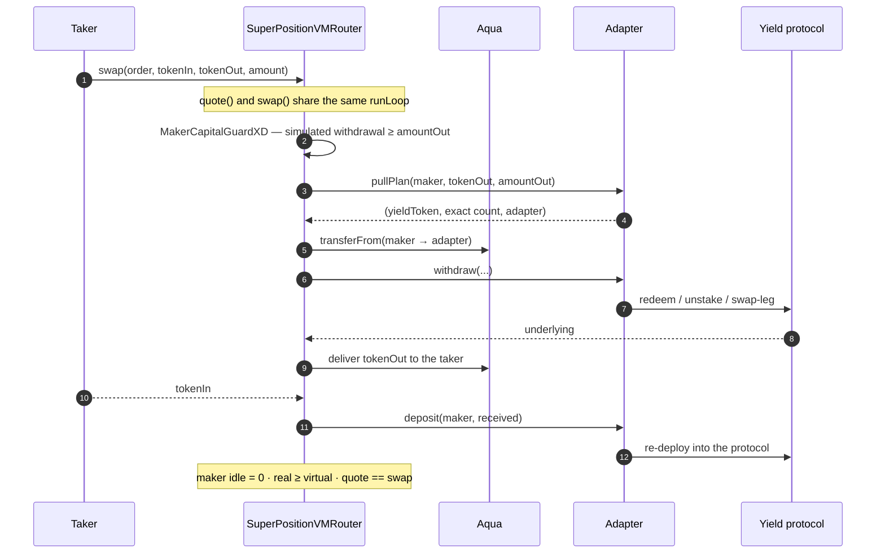
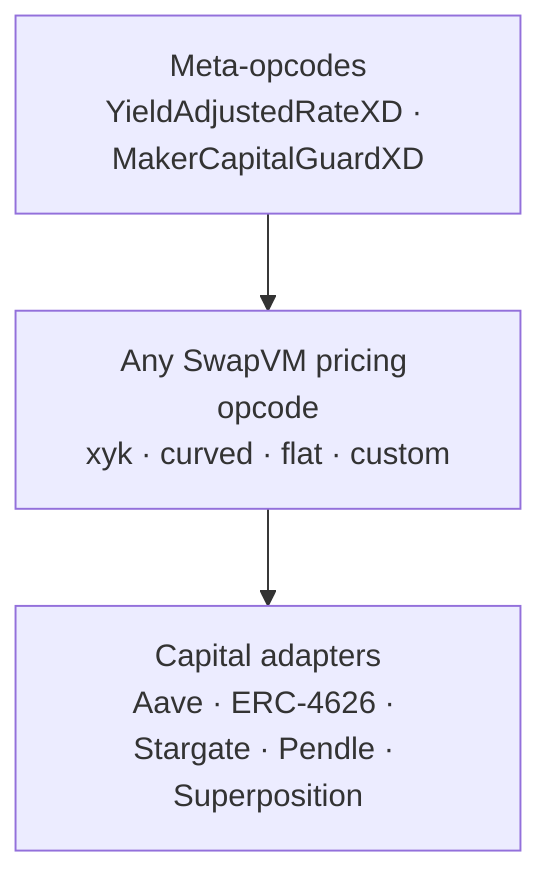

<p align="center">
  
</p>

<h1 align="center">Superposition-Liquid</h1>

<p align="center">
  
  
  
  
</p>

**A meta-layer for 1inch Aqua / SwapVM.** Superposition adds two composable layers on top of
*any* SwapVM strategy — **capital adapters** (JIT withdraw/deposit hooks) and **meta-opcodes**
(oracle guards, yield-rate scaling, capital checks). It ships no pricing curve: it wraps the
one you already have, so maker capital earns yield between fills while the pool keeps a normal
AMM surface.

Built for ETHGlobal **ETHOnline 2026** — Bounties: **1inch Aqua** (primary),
**Chainlink Data Feeds** (secondary).

---

## The idea

Makers ship a strategy on 1inch Aqua. Instead of leaving liquidity idle in their wallet, they
point `MakerConfig` at a yield protocol **per token**. Every fill cycles that capital *inside
the swap transaction itself*:

- `preTransferOut` → JIT withdraw / redeem / unstake from the maker's yield position, deliver to the taker;
- `postTransferIn` → re-deploy the received tokens into the protocol, same transaction.

The maker wallet holds tokens only for the duration of one transaction. Idle balance stays
**zero**, and 100% of the capital earns the protocol's yield **on top of swap fees** — same
capital, two income streams.

## How a fill works



Three invariants hold around every fill (enforced by the design, fuzz-tested 256 runs):

| Invariant | Meaning |
|---|---|
| `quote() == swap()` | a passing quote is a **fillability oracle**; a failing one returns the exact on-chain revert reason |
| maker idle balance `= 0` | capital is never left sitting in the wallet |
| `real ≥ virtual` | over-quoting can only fail a fill, never oversell |

## Liquidity lifecycle — UML time diagram

The full life of the maker's capital: **deploy → ship → fills (JIT) → yield → withdraw**.
Everything inside the fill blocks is a **single atomic transaction** — if any step reverts, the
whole fill reverts and capital never moves.

```mermaid
sequenceDiagram
    autonumber
    actor M as Maker
    actor T as Taker
    participant R as SuperPositionVMRouter
    participant AQ as Aqua
    participant AD as Adapter
    participant Y as Yield protocol (Aave v3)

    rect rgb(12, 22, 34)
        Note over M,Y: 1 · DEPLOY — capital goes to work (once)
        M->>AD: transfer underlying
        M->>AD: deposit(maker, token, amount)
        AD->>Y: supply(amount)
        Y-->>AD: aTokens (yield-bearing balance)
        Note over AD: the adapter holds the position
        M->>R: approve router (underlying + aToken)
        M->>AQ: approve Aqua (underlying)
    end

    rect rgb(12, 22, 34)
        Note over M,AQ: 2 · SHIP — expose a market on Aqua (once)
        M->>R: setSides(token -> adapter, autoManaged)
        M->>AQ: ship(router, order, tokens, virtualAmounts)
        Note over AQ: virtual balances are in underlying units — real capital stays deployed
    end

    rect rgb(9, 28, 34)
        Note over T,Y: 3 · FILL — taker buys tokenOut, pays tokenIn (ONE atomic tx)
        T->>R: swap(order, tokenIn, tokenOut, amountIn)
        R->>R: MakerCapitalGuardXD — simulated withdrawal >= amountOut
        R->>AD: pullPlan(maker, tokenOut, amountOut)
        AD-->>R: (aToken, exact count, adapter)
        R->>M: transferFrom(maker -> adapter)
        R->>AD: withdraw(maker, tokenOut, amountOut)
        AD->>Y: withdraw(amountOut)
        Y-->>AD: underlying
        AD-->>M: underlying (JIT unwrap)
        R->>T: tokenOut delivered
        T-->>M: tokenIn received (Aqua pull)
        R->>AD: deposit(maker, tokenIn, amountIn)
        AD->>Y: supply(amountIn)
        Note over R: maker idle tokenOut = 0 · real >= virtual
    end

    rect rgb(9, 24, 18)
        Note over AD,Y: 4 · BETWEEN FILLS — capital keeps earning
        Y-->>AD: aToken balance / vault shares grow
        Note over R: the next quote is already priced with the accrued yield
    end

    rect rgb(9, 28, 34)
        Note over T,Y: 5 · REVERSE FILL — taker sells tokenOut back (ONE atomic tx)
        T->>R: swap(order, tokenOut, tokenIn, amountIn)
        R->>AD: pullPlan(maker, tokenIn, amountIn)
        R->>AD: withdraw(maker, tokenIn, amountIn)
        AD->>Y: withdraw(amountIn)
        AD-->>M: tokenIn (JIT unwrap)
        R->>T: tokenIn delivered
        T-->>M: tokenOut received
        R->>AD: deposit(maker, tokenOut, amountOut)
        AD->>Y: supply(amountOut)
    end

    rect rgb(26, 20, 30)
        Note over M,Y: 6 · WITHDRAW — take liquidity out
        M->>AD: withdraw(maker, token, amount)
        AD->>Y: withdraw(amount)
        Y-->>M: underlying to wallet
        M->>AQ: dock(router, strategyHash, tokens)
    end
```



**Reading it**

- **Blocks 1–2 are one-time setup.** Capital first moves into the yield protocol, then the market
  is exposed on Aqua with virtual balances (pre-scaled by the ship-time rate).
- **Blocks 3 and 5 are the two fill directions.** `preTransferOut` (JIT withdraw) and
  `postTransferIn` (JIT deposit) run **inside the swap transaction**: the taker sees one swap, the
  capital never rests idle, and the maker's idle balance is `0` after the fill.
- **Block 4 is the point of the whole design.** Between fills 100% of the capital sits in the
  protocol earning; the next quote already reflects the accrued rate (yield-adjusted opcode).
- **Block 6 undeploys.** Withdraw from the protocol to the wallet, then `dock` the strategy from
  Aqua so it can no longer be filled.

## Architecture

**Superposition ships no pricing math.** It composes with whatever SwapVM program the maker
writes: xyk, curved, flat-price, or a third-party curve dropped into the same program.



### Capital adapters

Every maker configures, per token, which protocol holds their capital — a single registry
lookup the hooks resolve at fill time:

```solidity
struct SideConfig {
    address underlying;   // e.g. WETH, USDC
    address adapter;      // the protocol holding THIS side's capital
    AdapterKind kind;     // AaveV3 | ERC4626 | Stargate | PendlePT | SuperpositionUniHook
    bool autoManaged;     // JIT-deploy on receive, JIT-withdraw on send
}
```

| Adapter | Capital sits in | Yield |
|---|---|---|
| `AaveV3Adapter` | `aWETH` / `aUSDC` | variable supply APY |
| `ERC4626Adapter` | any ERC-4626 vault (Morpho, Euler, …) | vault yield |
| `StargateAdapter` | Stargate V2 pool LP, staked | bridge reward stream |
| `PendlePTAdapter` | Pendle PT (expired = 1:1 · active = fixed income) | **fixed APY** |
| `SuperpositionUniAdapter` | [Superposition](docs/superposition-uni-adapter.md) v4 hook buckets (USDC/USDT, ERC-1155 LP) | Aave yield + v4 fees |

The adapters are **pull-less**: the router executes each adapter's `pullPlan` (token, exact
count, destination) with its **own** allowance — the maker approves the router once per token
and never re-approves when switching protocols.

Beyond yield, a side can be **borrow-sourced**: `MakerConfig.BorrowConfig`
(`enabled`, `collateral`, `maxDebt`) lets an `AaveV3Adapter` side quote an asset the maker
does **not** hold, borrowing it against yield-bearing collateral — the matching in-fill
repays the debt first (see [docs/borrow-adapter.md](docs/borrow-adapter.md)).

### Meta-opcodes

Appended to the SwapVM dispatch table (append-only — every existing opcode keeps its index).
They are **curve-agnostic**: they run before or after the pricing opcode and never replace it.

| Opcode | What it does |
|---|---|
| `YieldAdjustedRateXD` *(byte 34)* | scales swap registers by `rate(now)/rate(ship)` — quotes stay accurate in underlying terms while capital sits in yield tokens |
| `MakerCapitalGuardXD` *(byte 35)* | makes `quote()` a complete fill-oracle: reverts unless an actual withdrawal of the delivery amount would succeed right now |

## Quickstart

```bash
cd foundry

# full test suite (unit + invariants; fork tests need an RPC)
forge test

# live walkthrough: spin a funded anvil fork, deploy + arm the stack, run a scenario
./script/start-anvil.sh base
# wait for "ready: pick a scenario", then:
forge script script/base/AaveScenario.s.sol \
  --fork-url http://localhost:8545 --broadcast --skip-simulation
```

Each scenario prints the maker's capital state at every step (setup → ship → fill); idle
balances stay `0` and capital cycles JIT through the configured adapter. Per-chain command
sheet in [foundry/script/README.md](foundry/script/README.md).

## Tests

`forge test` — **101 tests**, no mocks in the fork suites (real Aqua, real protocols, real
Chainlink feeds).

| Suite | What it proves |
|---|---|
| `test/unit/` | every adapter against protocol-faithful mocks, both meta-opcodes, the config registry |
| `test/unit/invariants/` | fuzz (256 runs): idle `0`, `real ≥ virtual`, `quote == swap` across randomized fill sequences |
| `test/fork/BaseFork.t.sol` · `BaseForkErc4626.t.sol` · `BaseForkStargate.t.sol` · `BaseForkMixedAdapters.t.sol` | **Base mainnet fork**: Aave, Morpho + Euler, Stargate, and a mixed two-protocol maker |
| `test/fork/MainnetForkWstETH.t.sol` · `MainnetForkPendleActive.t.sol` | **Ethereum fork**: Lido wstETH + Curve, active Pendle PT-wstETH |
| `test/fork/ArbitrumForkPendle.t.sol` | **Arbitrum fork**: expired Pendle PT, redemption chain with zero swap legs |
| `test/fork/EthereumForkSuperposition.t.sol` | **Ethereum fork**: the Superposition v4 hook with Aave ERC-4626 wrapper vaults |

Real-vault fork testing caught two bugs invisible in mocks: a unit mismatch (shipping virtual
balances in share counts while fills move underlying units — fixed with the `rate(now)/rate(ship)`
design) and Pendle's callback conventions.

## Deployments

**Mainnet support**

| Chain | Chain ID | Config / RPC |
|---|---|---|
| Base | 8453 | `script/BaseChain.s.sol` — `https://mainnet.base.org` |
| Ethereum | 1 | addresses inline in `script/DeployAndSetup.s.sol` — `https://ethereum-rpc.publicnode.com` |

Adapters are **chain-agnostic**: they take the protocol's pool/vault addresses, so `✅` below
means the protocol is live on that chain and the adapter can target it. The fork-proven chains
are listed in the Tests section.

| Adapter | Protocol | Base | Ethereum |
|---|---|---|---|
| `AaveV3Adapter` | Aave v3 | ✅ | ✅ |
| `ERC4626Adapter` | Morpho / Euler v2 / Aave wrappers | ✅ | ✅ |
| `StargateAdapter` | Stargate v2 | ✅ | ✅ |
| `PendlePTAdapter` | Pendle | ✅ | ✅ |
| `SuperpositionUniAdapter` | Superposition v4 hook | ❌ | ✅ |

**Testnet support**

| Testnet | Chain ID | Config file | RPC |
|---|---|---|---|
| Ethereum Sepolia | 11155111 | `SepoliaChain.s.sol` | `https://ethereum-sepolia.publicnode.com` |
| Base Sepolia | 84532 | `BaseSepoliaChain.s.sol` | `https://sepolia.base.org` |

Aqua + SwapVM use the **same vanity addresses** on mainnet and testnets. Morpho, Euler,
Pendle and wstETH have no public testnet deployments (permissionless — deploy your own).

**Live on Ethereum Sepolia** (`script/sepolia/DeploySepolia.s.sol`, chainId 11155111):

| Contract | Address |
|---|---|
| MakerConfig | `0xF56EBe6386F40969A9721C6aB3fa07BEaD1Bd926` |
| SuperPositionVMRouter | `0x201D78030bed2d81F827B7650E2CB7C00Ea0c9EC` |
| AaveV3Adapter | `0xd915d3Db7f18f75D67c63B3Aa00872fbCE793c57` |
| ERC4626Adapter (Aave-backed vaults) | `0xb1B9955600DfAF8987da8c9D0A37F2d2ee4B8752` |
| SuperPosition USDC vault (ERC-4626) | `0x4F32F6bE82407E7956E5752672677542379a1ec8` |
| SuperPosition USDT vault (ERC-4626) | `0x0d98E00F0EFfE80a8Afd23FbA7cd0483E46CAa8D` |
| SuperpositionHook (v4, USDC/USDT fee=100 spacing=1) | `0x6A7A2C6495A16f0a4c77E771f8A3945ee3494aC0` |
| SuperpositionUniAdapter | `0x1be3291f7Ef08e56f0141007F49846fB07794C8B` |
| Aave v3 Pool | `0x6Ae43d3271ff6888e7Fc43Fd7321a503ff738951` |
| Aave testnet Faucet | `0xC959483DBa39aa9E78757139af0e9a2EDEb3f42D` |
| SepoliaFaucetBatch (`mintAll` in one tx) | `0xE05742c33bf6b347919B26934fa1Df9eF056F156` |
| OrderBuilder (`build` order bytes for `aqua.ship`) | `0x593f18800df097f059270357948F24bC677f50c5` |

Testnet scarcity: Aave Sepolia's stable reserves (USDC/USDT/DAI) are **at their supply cap**
(`SUPPLY_CAP_EXCEEDED`), so `Aave4626Vault` (and the hook) fall back to **idle** — both the
`AaveV3Adapter` and the `ERC4626Adapter` routes are fully functional on Sepolia (deposit,
withdraw, JIT cycling, LP shares) but yield accrues only on mainnet. Sepolia USDC/USDT are
mintable via the Aave faucet (`mint(token,to,amount)`).

**Verified without an Etherscan key.** All Sepolia contracts are verified on **Sourcify**
(`exact_match`), which is keyless and also propagates to Etherscan / Routescan / Blockscout:

```
forge verify-contract <address> <path:Contract> --chain 11155111 \
  --verifier sourcify --verifier-url https://sourcify.dev/server/ \
  --constructor-args $(cast abi-encode "constructor(...)" ...)
```

Verified: `MakerConfig`, `SuperPositionVMRouter` (SepoliaRouter), `AaveV3Adapter`,
`ERC4626Adapter`, the two ERC-4626 vaults, `SuperpositionHook`, `SuperpositionUniAdapter`,
`SepoliaFaucetBatch`, `OrderBuilder`.

### Vercel (frontend)

The maker console lives in `app/` (Next.js 16, React 19, wagmi + Reown AppKit). One-shot
deploy:

- **Root Directory**: `app`
- **Framework**: Next.js (auto-detected) — build `npm run build`, install `npm install`
- **Environment variable**: `NEXT_PUBLIC_PROJECT_ID` = your Reown/WalletConnect project id

`.env*` is gitignored, so set the variable in the Vercel dashboard. The build also succeeds
**without** it (the wallet UI stays disabled until it is set), so the deploy never fails on a
missing key. Node 20.9+ (Vercel default 22 is fine).

## Repository layout

```
foundry/
  src/
    SuperPositionVMRouter.sol        # SwapVM fork + JIT maker hooks + custom opcode table
    config/MakerConfig.sol           # per-maker, per-token adapter registry
    adapters/                        # AaveV3 · ERC4626 · Stargate · Pendle · wstETH · Superposition
    interfaces/                      # ILendingAdapter, AggregatorV3Interface, IStataTokenFactory
    opcodes/                         # YieldAdjustedRateOpcode (34) · MakerCapitalGuardOpcode (35)
  script/
    base/ arbitrum/ ethereum/        # per-chain scenario scripts (one per adapter)
    AnvilScenario.s.sol              # scenario base: approvals, setSides, ship, fills
    DeployAndSetup.s.sol             # multi-chain deploy + arm (self-deploys the Superposition hook)
    start-anvil.sh                   # funded anvil fork + auto deploy/arm
  test/                              # unit + invariants + fork
docs/
  SPEC.md                            # full design + decision log
  ADDRESSES.md                       # mainnet + testnet addresses
  superposition-uni-adapter.md       # Superposition hook deep-dive
  pendle-adapter.md stargate-adapter.md
  ROADMAP.md                         # what is not built yet
```

Dependency pins: `1inch/swap-vm` **v1.0.2**, `1inch/aqua` **v1.0.0**, `openzeppelin` **v5.4.0**,
`@1inch/solidity-utils` **6.9.7**, Solidity **0.8.30**.

## Scope

Superposition deliberately does **not**:

- implement pricing curves — it wraps any SwapVM program;
- route swaps — discovery and routing stay with 1inch's resolver network;
- custody funds — capital lives in the maker's wallet or in the protocol they chose, and the
  adapter only moves tokens inside the maker's own fill.

See [docs/ROADMAP.md](docs/ROADMAP.md) for what is planned next.

## License

[MIT](LICENSE).
