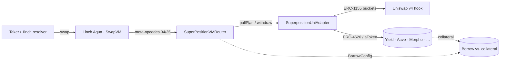
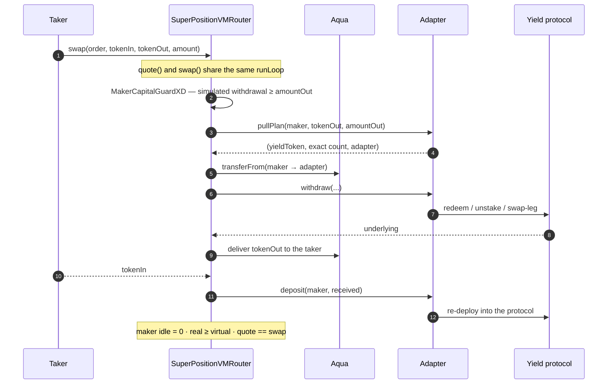
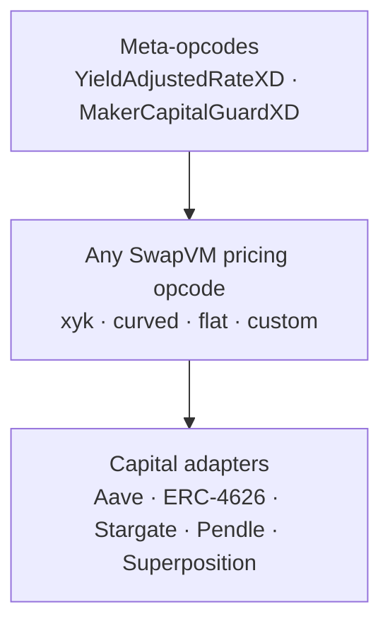

<p align="center">
  
</p>

<h1 align="center">Superposition-Liquid</h1>

<p align="center">
  
  
  
  
</p>

> [!IMPORTANT]
> ### 👀 Uniswap v4 judges — the hook is a **separate repository**
> **[github.com/SolidityDrone/superposition-hook-uni-v4](https://github.com/SolidityDrone/superposition-hook-uni-v4/)**
>
> The **Uniswap v4 concentrated-liquidity hook** (tick ranges as ERC-1155 buckets, Aave-backed
> ERC-4626 capital, one-sided limit orders) lives in that repo. **This** repo is the **1inch
> Aqua / SwapVM meta-layer that wraps it** — capital adapters, meta-opcodes, JIT yield **and
> borrowing**. Read the hook first; everything below is how it plugs into Aqua.

**A meta-layer for 1inch Aqua / SwapVM.** Superposition adds two composable layers on top of
*any* SwapVM strategy — **capital adapters** (JIT withdraw/deposit hooks) and **meta-opcodes**
(oracle guards, yield-rate scaling, capital checks). It ships no pricing curve: it wraps the
one you already have, so maker capital earns yield between fills while the pool keeps a normal
AMM surface.

Built for ETHGlobal **ETHOnline 2026** — Bounties: **1inch Aqua** (primary),
**Chainlink Data Feeds** (secondary).

---

## The idea

Makers ship a strategy on 1inch Aqua. Instead of leaving liquidity idle in their wallet, they
point `MakerConfig` at a yield protocol **per token**. Every fill cycles that capital *inside
the swap transaction itself*:

- `preTransferOut` → JIT withdraw / redeem / unstake from the maker's yield position, deliver to the taker;
- `postTransferIn` → re-deploy the received tokens into the protocol, same transaction.

The maker wallet holds tokens only for the duration of one transaction. Idle balance stays
**zero**, and 100% of the capital earns the protocol's yield **on top of swap fees** — same
capital, two income streams.

## The three layers — 1inch ⟷ Uniswap hook ⟷ yield & borrowing

Superposition is the **glue** between three things that normally don't compose:



| Layer | Who owns it | What Superposition adds |
|---|---|---|
| **1inch Aqua / SwapVM** | the program + execution | two **meta-opcodes** (34 yield-rate scaling, 35 capital guard) appended to *any* shipped program |
| **Uniswap v4 hook** | the pricing/liquidity engine | `SuperpositionUniAdapter` exposes the hook's tick-range **ERC-1155 buckets** as a venue the router can pull from |
| **Yield & borrowing** | the capital venue | capital rests in ERC-4626 / Aave between fills; **borrowing lets a maker quote an asset they don't hold** |

**Why borrowing matters.** A maker's quotable size is normally capped by the inventory they hold.
With `MakerConfig.BorrowConfig`, a side can be *sourced by debt*: the maker quotes an asset they
**don't own**, borrowed against yield-bearing collateral that keeps earning while it is pledged.
The matching in-fill repays the debt first. So the same collateral backs **both** the position and
the borrowed side — **borrowing directly increases the surface of liquidity a maker can provide**,
without a second unit of capital. (The configured collateral + the `maxDebt` risk capacitor are the
soft isolation; the `MakerCapitalGuard` opcode still rejects any fill the *real* capital can't cover.)

## How a fill works




Three invariants hold around every fill (enforced by the design, fuzz-tested 256 runs):

| Invariant | Meaning |
|---|---|
| `quote() == swap()` | a passing quote is a **fillability oracle**; a failing one returns the exact on-chain revert reason |
| maker idle balance `= 0` | capital is never left sitting in the wallet |
| `real ≥ virtual` | over-quoting can only fail a fill, never oversell |

## Liquidity lifecycle — UML time diagram

The full life of the maker's capital: **deploy → ship → fills (JIT) → yield → withdraw**.
Everything inside the fill blocks is a **single atomic transaction** — if any step reverts, the
whole fill reverts and capital never moves.

```mermaid
sequenceDiagram
    autonumber
    actor M as Maker
    actor T as Taker
    participant R as SuperPositionVMRouter
    participant AQ as Aqua
    participant AD as Adapter
    participant Y as Yield protocol (Aave v3)

    rect rgb(12, 22, 34)
        Note over M,Y: 1 · DEPLOY — capital goes to work (once)
        M->>AD: transfer underlying
        M->>AD: deposit(maker, token, amount)
        AD->>Y: supply(amount)
        Y-->>AD: aTokens (yield-bearing balance)
        Note over AD: the adapter holds the position
        M->>R: approve router (underlying + aToken)
        M->>AQ: approve Aqua (underlying)
    end

    rect rgb(12, 22, 34)
        Note over M,AQ: 2 · SHIP — expose a market on Aqua (once)
        M->>R: setSides(token -> adapter, autoManaged)
        M->>AQ: ship(router, order, tokens, virtualAmounts)
        Note over AQ: virtual balances are in underlying units — real capital stays deployed
    end

    rect rgb(9, 28, 34)
        Note over T,Y: 3 · FILL — taker buys tokenOut, pays tokenIn (ONE atomic tx)
        T->>R: swap(order, tokenIn, tokenOut, amountIn)
        R->>R: MakerCapitalGuardXD — simulated withdrawal >= amountOut
        R->>AD: pullPlan(maker, tokenOut, amountOut)
        AD-->>R: (aToken, exact count, adapter)
        R->>M: transferFrom(maker -> adapter)
        R->>AD: withdraw(maker, tokenOut, amountOut)
        AD->>Y: withdraw(amountOut)
        Y-->>AD: underlying
        AD-->>M: underlying (JIT unwrap)
        R->>T: tokenOut delivered
        T-->>M: tokenIn received (Aqua pull)
        R->>AD: deposit(maker, tokenIn, amountIn)
        AD->>Y: supply(amountIn)
        Note over R: maker idle tokenOut = 0 · real >= virtual
    end

    rect rgb(9, 24, 18)
        Note over AD,Y: 4 · BETWEEN FILLS — capital keeps earning
        Y-->>AD: aToken balance / vault shares grow
        Note over R: the next quote is already priced with the accrued yield
    end

    rect rgb(9, 28, 34)
        Note over T,Y: 5 · REVERSE FILL — taker sells tokenOut back (ONE atomic tx)
        T->>R: swap(order, tokenOut, tokenIn, amountIn)
        R->>AD: pullPlan(maker, tokenIn, amountIn)
        R->>AD: withdraw(maker, tokenIn, amountIn)
        AD->>Y: withdraw(amountIn)
        AD-->>M: tokenIn (JIT unwrap)
        R->>T: tokenIn delivered
        T-->>M: tokenOut received
        R->>AD: deposit(maker, tokenOut, amountOut)
        AD->>Y: supply(amountOut)
    end

    rect rgb(26, 20, 30)
        Note over M,Y: 6 · WITHDRAW — take liquidity out
        M->>AD: withdraw(maker, token, amount)
        AD->>Y: withdraw(amount)
        Y-->>M: underlying to wallet
        M->>AQ: dock(router, strategyHash, tokens)
    end
```



**Reading it**

- **Blocks 1–2 are one-time setup.** Capital first moves into the yield protocol, then the market
  is exposed on Aqua with virtual balances (pre-scaled by the ship-time rate).
- **Blocks 3 and 5 are the two fill directions.** `preTransferOut` (JIT withdraw) and
  `postTransferIn` (JIT deposit) run **inside the swap transaction**: the taker sees one swap, the
  capital never rests idle, and the maker's idle balance is `0` after the fill.
- **Block 4 is the point of the whole design.** Between fills 100% of the capital sits in the
  protocol earning; the next quote already reflects the accrued rate (yield-adjusted opcode).
- **Block 6 undeploys.** Withdraw from the protocol to the wallet, then `dock` the strategy from
  Aqua so it can no longer be filled.

## Architecture

**Superposition ships no pricing math.** It composes with whatever SwapVM program the maker
writes: xyk, curved, flat-price, or a third-party curve dropped into the same program.



### Capital adapters

Every maker configures, per token, which protocol holds their capital — a single registry
lookup the hooks resolve at fill time:

```solidity
struct SideConfig {
    address underlying;   // e.g. WETH, USDC
    address adapter;      // the protocol holding THIS side's capital
    AdapterKind kind;     // AaveV3 | ERC4626 | Stargate | PendlePT | SuperpositionUniHook
    bool autoManaged;     // JIT-deploy on receive, JIT-withdraw on send
}
```

| Adapter | Capital sits in | Yield |
|---|---|---|
| `AaveV3Adapter` | `aWETH` / `aUSDC` | variable supply APY |
| `ERC4626Adapter` | any ERC-4626 vault (Morpho, Euler, …) | vault yield |
| `StargateAdapter` | Stargate V2 pool LP, staked | bridge reward stream |
| `PendlePTAdapter` | Pendle PT (expired = 1:1 · active = fixed income) | **fixed APY** |
| `SuperpositionUniAdapter` | [Superposition](docs/superposition-uni-adapter.md) v4 hook buckets (USDC/USDT, ERC-1155 LP) | Aave yield + v4 fees |

The adapters are **pull-less**: the router executes each adapter's `pullPlan` (token, exact
count, destination) with its **own** allowance — the maker approves the router once per token
and never re-approves when switching protocols.

Beyond yield, a side can be **borrow-sourced**: `MakerConfig.BorrowConfig`
(`enabled`, `collateral`, `maxDebt`) lets an `AaveV3Adapter` side quote an asset the maker
does **not** hold, borrowing it against yield-bearing collateral — the matching in-fill
repays the debt first (see [docs/borrow-adapter.md](docs/borrow-adapter.md)).

### Meta-opcodes

Appended to the SwapVM dispatch table (append-only — every existing opcode keeps its index).
They are **curve-agnostic**: they run before or after the pricing opcode and never replace it.

| Opcode | What it does |
|---|---|
| `YieldAdjustedRateXD` *(byte 34)* | scales swap registers by `rate(now)/rate(ship)` — quotes stay accurate in underlying terms while capital sits in yield tokens |
| `MakerCapitalGuardXD` *(byte 35)* | makes `quote()` a complete fill-oracle: reverts unless an actual withdrawal of the delivery amount would succeed right now |

## Quickstart

```bash
cd foundry

# full test suite (unit + invariants; fork tests need an RPC)
forge test

# live walkthrough: spin a funded anvil fork, deploy + arm the stack, run a scenario
./script/start-anvil.sh base
# wait for "ready: pick a scenario", then:
forge script script/base/AaveScenario.s.sol \
  --fork-url http://localhost:8545 --broadcast --skip-simulation
```

Each scenario prints the maker's capital state at every step (setup → ship → fill); idle
balances stay `0` and capital cycles JIT through the configured adapter. Per-chain command
sheet in [foundry/script/README.md](foundry/script/README.md).

## Tests

`forge test` — **101 tests**, no mocks in the fork suites (real Aqua, real protocols, real
Chainlink feeds).

| Suite | What it proves |
|---|---|
| `test/unit/` | every adapter against protocol-faithful mocks, both meta-opcodes, the config registry |
| `test/unit/invariants/` | fuzz (256 runs): idle `0`, `real ≥ virtual`, `quote == swap` across randomized fill sequences |
| `test/fork/BaseFork.t.sol` · `BaseForkErc4626.t.sol` · `BaseForkStargate.t.sol` · `BaseForkMixedAdapters.t.sol` | **Base mainnet fork**: Aave, Morpho + Euler, Stargate, and a mixed two-protocol maker |
| `test/fork/MainnetForkWstETH.t.sol` · `MainnetForkPendleActive.t.sol` | **Ethereum fork**: Lido wstETH + Curve, active Pendle PT-wstETH |
| `test/fork/ArbitrumForkPendle.t.sol` | **Arbitrum fork**: expired Pendle PT, redemption chain with zero swap legs |
| `test/fork/EthereumForkSuperposition.t.sol` | **Ethereum fork**: the Superposition v4 hook with Aave ERC-4626 wrapper vaults |

Real-vault fork testing caught two bugs invisible in mocks: a unit mismatch (shipping virtual
balances in share counts while fills move underlying units — fixed with the `rate(now)/rate(ship)`
design) and Pendle's callback conventions.

## Deployments

**Mainnet support**

| Chain | Chain ID | Config / RPC |
|---|---|---|
| Base | 8453 | `script/BaseChain.s.sol` — `https://mainnet.base.org` |
| Ethereum | 1 | addresses inline in `script/DeployAndSetup.s.sol` — `https://ethereum-rpc.publicnode.com` |

Adapters are **chain-agnostic**: they take the protocol's pool/vault addresses, so `✅` below
means the protocol is live on that chain and the adapter can target it. The fork-proven chains
are listed in the Tests section.

| Adapter | Protocol | Base | Ethereum |
|---|---|---|---|
| `AaveV3Adapter` | Aave v3 | ✅ | ✅ |
| `ERC4626Adapter` | Morpho / Euler v2 / Aave wrappers | ✅ | ✅ |
| `StargateAdapter` | Stargate v2 | ✅ | ✅ |
| `PendlePTAdapter` | Pendle | ✅ | ✅ |
| `SuperpositionUniAdapter` | Superposition v4 hook | ❌ | ✅ |

**Testnet support**

| Testnet | Chain ID | Config file | RPC |
|---|---|---|---|
| **Base Sepolia** ← the console targets this | 84532 | `script/base-sepolia/DeployBaseSepolia.s.sol` | `https://sepolia.base.org` |
| Ethereum Sepolia | 11155111 | `SepoliaChain.s.sol` | `https://ethereum-sepolia.publicnode.com` |

> ⚠️ **Aqua + the 1inch SwapVM router are NOT deployed on Base Sepolia** (the `0x111…` vanity has
> no code there) — our deploy publishes **our own Aqua**. Morpho, Euler, Pendle and wstETH have no
> public testnet deployments (permissionless — deploy your own).

**Live on Base Sepolia** (`script/base-sepolia/DeployBaseSepolia.s.sol`, chainId 84532) —
Sourcify `exact_match`, **12/12**:

| Contract | Address |
|---|---|
| Aqua (ours) | `0x06DC4edCF4F3ABdFa65Cc4fD58AB459B5ff20F9e` |
| MakerConfig | `0x0196eeF216fAF47DE34bcbEd5fB1ab4f97A932ee` |
| SuperPositionVMRouter | `0x4fefc5D38eE27f09F68484574A3B4AAC914d4097` |
| AaveV3Adapter | `0x56BE9DC69c798BC8B7567958b1B45f4b6e4502eb` |
| ERC4626Adapter | `0x0f47Ca0065B7f0Ff00eEDf6D92D977389Aa8CcbF` |
| SuperPosition USDC vault (ERC-4626) | `0x126b97C6AF4748118504A993e97EbAA1cb863576` |
| SuperPosition USDT vault (ERC-4626) | `0x682E0DBEF9Ce3487b06F961A8667fBdcb2093396` |
| SuperpositionHook (v4, USDT/USDC fee=100 spacing=1) | `0x2F6bA013a29967F3A638887f8BefB18424658Ac0` |
| SuperpositionUniAdapter | `0x81e92e910B978e5F3865E4E815660725662EE236` |
| OrderBuilder (`build` order bytes for `aqua.ship`) | `0x7a8F11c29FD46e21aA70638f8f6BA62777cf920C` |
| HookLpHelper (`provide`/`redeem` hook LP) | `0x24F0A572A6A7Ae73322aB5B19Ee83d50343A5D23` |
| SepoliaFaucetBatch (`mintAll` in one tx) | `0xbe135721492C6525cAf47454aEEFc37B378bf895` |

Unlike Ethereum Sepolia (where the stable reserves sit at their supply cap, so the ERC-4626
vaults fall back to **idle**), **Base Sepolia's USDC / USDT / WETH reserves are not capped** — the
ERC-4626 vaults hold **real aTokens** and the JIT movement is live. There is no official Aave
waToken (StataToken) factory on Base Sepolia, so the wrapper is our `Aave4626Vault`. USDC/USDT are
mintable via the Aave Base Sepolia faucet `0xD9145b5F45Ad4519c7ACcD6E0A4A82e83bB8A6Dc`.

**Verified keyless on Sourcify (`exact_match`).** All contracts are verified on
**[Sourcify](https://sourcify.dev)** with no API key. Note: **Etherscan/BaseScan does not read
Sourcify** without its own API key, so the explorer "Contract" tab may show unverified — trust the
Sourcify links below (`exact_match` = creation + runtime). Routescan / Blockscout do index Sourcify.

```
forge verify-contract <address> <path:Contract> --chain 84532 \
  --verifier sourcify --verifier-url https://sourcify.dev/server/ \
  --rpc-url https://sepolia.base.org \
  --constructor-args $(cast abi-encode "constructor(...)" ...)
```

Verified (12/12): `Aqua`, `MakerConfig`, `SuperPositionVMRouter`, `AaveV3Adapter`,
`ERC4626Adapter`, the two ERC-4626 vaults, `SuperpositionHook`, `SuperpositionUniAdapter`,
`OrderBuilder`, `HookLpHelper`, `SepoliaFaucetBatch`.

### 📜 Live make ⇄ take on Base Sepolia

A maker ships an order on Aqua and a **separate taker** takes it — signature-less
(`useAquaInsteadOfSignature`), capital JIT-cycled through the Aave ERC-4626 vaults:

| Demo | ship | swap | result |
|---|---|---|---|
| **USDC → WETH** | [`0x8d7ea4…`](https://sepolia.basescan.org/tx/0x8d7ea40c376dfa76e1748b4bfb9a6623dff6839714d8797aa9b68611309f595a) | [`0xc5871d…`](https://sepolia.basescan.org/tx/0xc5871d8b99e98fc1fb7311f89050568678f6bbeef87ac00294e6bcc1fb583f16) | 1 USDC → 0.0009066 WETH |
| **USDC → USDT** (no WETH, no hook) | [`0xa1991f…`](https://sepolia.basescan.org/tx/0xa1991fb8f22245622d2c5c07b2e58104f3e291c000b5ff14ee8d8fa199d293dd) | [`0x91db65…`](https://sepolia.basescan.org/tx/0x91db65a7c83a2ef15a1a3071483e7a0ee542e6c4080b9f15ccbc97e62f553526) | 1 USDC → 0.9066 USDT |

Read the swap tx's token transfers: the fill **burns `aUSDT`** in the spUSDT vault to deliver
(`aUSDT` 1000 → 999.09) and **mints `aUSDC`** in the spUSDC vault on the received side — real Aave
movement inside a single 1inch/Aqua transaction.

Reproduce — `forge script script/base-sepolia/DeployBaseSepolia.s.sol` (deploy), then
`BaseSepoliaStableSwap.s.sol` / `BaseSepoliaDemo.s.sol` (ship + take).

### ✅ Verified contracts — Sourcify `exact_match` (Base Sepolia, 12/12)

Every address below is **`exact_match`** on Sourcify (creation + runtime). Click **Sourcify** to
open the lookup; the **BaseScan** link is only for address/tx context (BaseScan does not read
Sourcify without its own API key).

| Contract | Sourcify (exact_match) | BaseScan |
|---|---|---|
| `Aqua` (ours) | [lookup](https://sourcify.dev/#/lookup/0x06DC4edCF4F3ABdFa65Cc4fD58AB459B5ff20F9e) | [address](https://sepolia.basescan.org/address/0x06DC4edCF4F3ABdFa65Cc4fD58AB459B5ff20F9e) |
| `MakerConfig` | [lookup](https://sourcify.dev/#/lookup/0x0196eeF216fAF47DE34bcbEd5fB1ab4f97A932ee) | [address](https://sepolia.basescan.org/address/0x0196eeF216fAF47DE34bcbEd5fB1ab4f97A932ee) |
| `SuperPositionVMRouter` | [lookup](https://sourcify.dev/#/lookup/0x4fefc5D38eE27f09F68484574A3B4AAC914d4097) | [address](https://sepolia.basescan.org/address/0x4fefc5D38eE27f09F68484574A3B4AAC914d4097) |
| `AaveV3Adapter` | [lookup](https://sourcify.dev/#/lookup/0x56BE9DC69c798BC8B7567958b1B45f4b6e4502eb) | [address](https://sepolia.basescan.org/address/0x56BE9DC69c798BC8B7567958b1B45f4b6e4502eb) |
| `ERC4626Adapter` | [lookup](https://sourcify.dev/#/lookup/0x0f47Ca0065B7f0Ff00eEDf6D92D977389Aa8CcbF) | [address](https://sepolia.basescan.org/address/0x0f47Ca0065B7f0Ff00eEDf6D92D977389Aa8CcbF) |
| USDC vault (ERC-4626) | [lookup](https://sourcify.dev/#/lookup/0x126b97C6AF4748118504A993e97EbAA1cb863576) | [address](https://sepolia.basescan.org/address/0x126b97C6AF4748118504A993e97EbAA1cb863576) |
| USDT vault (ERC-4626) | [lookup](https://sourcify.dev/#/lookup/0x682E0DBEF9Ce3487b06F961A8667fBdcb2093396) | [address](https://sepolia.basescan.org/address/0x682E0DBEF9Ce3487b06F961A8667fBdcb2093396) |
| `SuperpositionHook` (v4) | [lookup](https://sourcify.dev/#/lookup/0x2F6bA013a29967F3A638887f8BefB18424658Ac0) | [address](https://sepolia.basescan.org/address/0x2F6bA013a29967F3A638887f8BefB18424658Ac0) |
| `SuperpositionUniAdapter` | [lookup](https://sourcify.dev/#/lookup/0x81e92e910B978e5F3865E4E815660725662EE236) | [address](https://sepolia.basescan.org/address/0x81e92e910B978e5F3865E4E815660725662EE236) |
| `OrderBuilder` | [lookup](https://sourcify.dev/#/lookup/0x7a8F11c29FD46e21aA70638f8f6BA62777cf920C) | [address](https://sepolia.basescan.org/address/0x7a8F11c29FD46e21aA70638f8f6BA62777cf920C) |
| `HookLpHelper` | [lookup](https://sourcify.dev/#/lookup/0x24F0A572A6A7Ae73322aB5B19Ee83d50343A5D23) | [address](https://sepolia.basescan.org/address/0x24F0A572A6A7Ae73322aB5B19Ee83d50343A5D23) |
| `SepoliaFaucetBatch` | [lookup](https://sourcify.dev/#/lookup/0xbe135721492C6525cAf47454aEEFc37B378bf895) | [address](https://sepolia.basescan.org/address/0xbe135721492C6525cAf47454aEEFc37B378bf895) |

The console (`app/`) points at this stack. Full address list (incl. external Aave/v4):
[`docs/ADDRESSES.md`](docs/ADDRESSES.md).


### Vercel (frontend)

The maker console lives in `app/` (Next.js 16, React 19, wagmi + Reown AppKit). One-shot
deploy:

- **Root Directory**: `app`
- **Framework**: Next.js (auto-detected) — build `npm run build`, install `npm install`
- **Environment variable**: `NEXT_PUBLIC_PROJECT_ID` = your Reown/WalletConnect project id

`.env*` is gitignored, so set the variable in the Vercel dashboard. The build also succeeds
**without** it (the wallet UI stays disabled until it is set), so the deploy never fails on a
missing key. Node 20.9+ (Vercel default 22 is fine).

### The Graph (composable & standardized data)

The console ships a live **Lending intelligence** panel backed by the **Messari Standardized Lending
Subgraphs** — one GraphQL query across **Aave v3 · Compound v3 · Morpho · Spark** — plus a
**SuperPosition Subgraph** (Subgraph Studio) that indexes the router fills, per-token adapter
config, borrow config and the **ERC-4626** vault flows.
See [`docs/thegraph.md`](docs/thegraph.md).

Env: `NEXT_PUBLIC_THEGRAPH_API_KEY` (app).

## Repository layout

```
foundry/
  src/
    SuperPositionVMRouter.sol        # SwapVM fork + JIT maker hooks + custom opcode table
    config/MakerConfig.sol           # per-maker, per-token adapter registry
    adapters/                        # AaveV3 · ERC4626 · Stargate · Pendle · wstETH · Superposition
    interfaces/                      # ILendingAdapter, AggregatorV3Interface, IStataTokenFactory
    opcodes/                         # YieldAdjustedRateOpcode (34) · MakerCapitalGuardOpcode (35)
  script/
    base/ arbitrum/ ethereum/        # per-chain scenario scripts (one per adapter)
    AnvilScenario.s.sol              # scenario base: approvals, setSides, ship, fills
    DeployAndSetup.s.sol             # multi-chain deploy + arm (self-deploys the Superposition hook)
    start-anvil.sh                   # funded anvil fork + auto deploy/arm
  test/                              # unit + invariants + fork
docs/
  SPEC.md                            # full design + decision log
  ADDRESSES.md                       # mainnet + testnet addresses
  superposition-uni-adapter.md       # Superposition hook deep-dive
  pendle-adapter.md stargate-adapter.md
  ROADMAP.md                         # what is not built yet
```

Dependency pins: `1inch/swap-vm` **v1.0.2**, `1inch/aqua` **v1.0.0**, `openzeppelin` **v5.4.0**,
`@1inch/solidity-utils` **6.9.7**, Solidity **0.8.30**.

## Scope

> [!NOTE]
> **Custom curves and strategies are explicitly out of scope.** Superposition ships **no curve of
> its own**: the meta-opcodes are **appendable to any SwapVM program** — xyk, concentrated,
> flat-price, RFQ, or a bespoke formula. Whatever you ship on Aqua stays yours; Superposition only
> changes *where the capital rests* (yield / ERC-4626 / hook buckets / borrowing) and *how it is
> protected* (the capital guard). The layer is deliberately **curve-agnostic** — that is the feature.

Superposition deliberately does **not**:

- implement pricing curves — it wraps any SwapVM program;
- route swaps — discovery and routing stay with 1inch's resolver network;
- custody funds — capital lives in the maker's wallet or in the protocol they chose, and the
  adapter only moves tokens inside the maker's own fill.

See [docs/ROADMAP.md](docs/ROADMAP.md) for what is planned next.

## License

[MIT](LICENSE).
